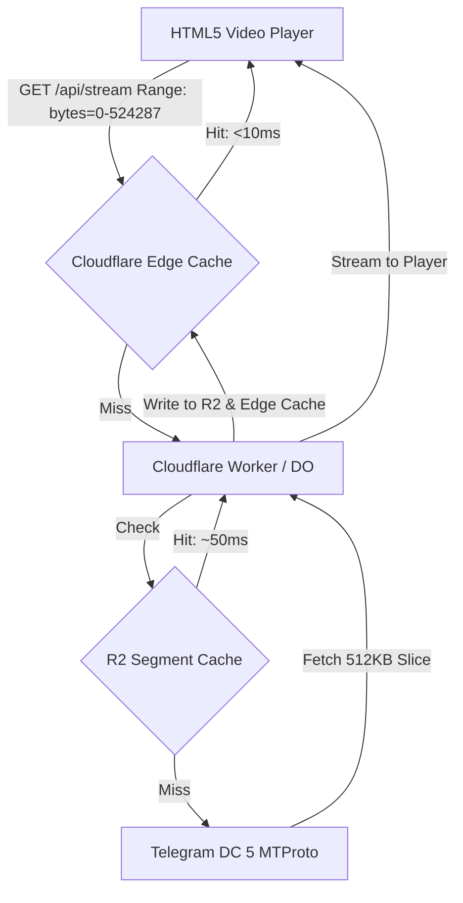

# 📋 Next Session Roadmap: Video Streaming & Upload Speed Optimization

## 🎯 Primary Goals for Next Session

1. **⚡ Upload Speed Acceleration**: Upgrade chunk size from 128KB to 512KB and enable concurrent part pipelining.
2. **🎬 Video Playback & Seeking Performance**: Implement Cloudflare Edge Caching and R2 video slice caching for sub-10ms chunk delivery.
3. **🖼️ Thumbnail & Preview Streaming**: Optimize R2 thumbnail caching and instant BlurHash rendering.

---

## ⚡ 1. Upload Speed Acceleration (512KB Chunks + Concurrency)

### Context & Why This Works:
Now that the backend is powered by **Telegram's Native WebSocket Gateways (`PromisedWebSockets` over `wss://flora.web.telegram.org/apiws`)**, we are no longer constrained by raw TCP stream buffer limits. Native WebSocket binary frames support 512KB chunks effortlessly.

### Speed Comparison:

| Metric | 128KB Chunks (Current) | 512KB Chunks (Target) | 512KB + 2x Concurrency |
| :--- | :--- | :--- | :--- |
| **Total Parts (14.1 MB file)** | 108 parts | 28 parts | 28 parts (14 batches) |
| **Network Roundtrip ACKs** | 108 ACKs | 28 ACKs (**4x fewer**) | 14 ACKs (**8x fewer**) |
| **Upload Time (Est.)** | ~15 seconds | **~3–5 seconds** | **~2–3 seconds** |

### Implementation Plan:
1. **Frontend (`UploaderModal.tsx`)**:
   - Update `CHUNK_SIZE = 512 * 1024` (524,288 bytes).
   - Stream 512KB binary frames over `/api/media/upload/ws`.
2. **Backend (`TelegramAuthDO.ts`)**:
   - Update `partSize = 512 * 1024`.
   - Dispatch `SaveBigFilePart` / `SaveFilePart` in parallel batches of 2 (`Promise.all([client.invoke(partA), client.invoke(partB)])`).

---

## 🎬 2. Video Streaming & Playback Optimization (Edge Cache + R2)

### Architecture Diagram:

### Key Optimizations:
1. **Cloudflare Edge Cache API (`caches.default`)**:
   - Telegram media bytes for a given `telegram_message_id` and byte range are immutable.
   - Cache video chunk responses with `Cache-Control: public, max-age=31536000, immutable`.
   - Video replays and seeking will resolve in **< 10ms** from the user's nearest Cloudflare edge location.
2. **R2 Video Segment Warm Cache (First-Play Staging)**:
   - On first playback, write downloaded 512KB slices to R2 (`videos/{channelId}/{mediaId}/part_{index}.bin`).
   - Subsequent requests bypass Telegram rate-limits and stream directly from R2 at ~100 MB/s.
3. **Read-Ahead Prefetching**:
   - When the player requests chunk $N$, prefetch chunk $N+1$ in the background so video never buffers or stutters.

---

## 🖼️ 3. Thumbnail Preview & Grid Performance

1. **R2 Public / Edge-Cached Thumbnail Delivery**:
   - Serve thumbnails (`thumbnails/{channelId}/{mediaId}.jpg`) with immutable cache headers.
2. **Instant BlurHash Placeholder**:
   - Decode BlurHash strings immediately on the client canvas before image downloads complete.

---

## 📁 Key Files to Modify in Next Session:
- `src/components/UploaderModal.tsx`: Chunk size upgrade to 512KB.
- `src/server/durable_objects/TelegramAuthDO.ts`: 512KB part streaming + concurrent pipelining.
- `src/app/api/stream/route.ts`: Edge Cache (`caches.default`) and R2 segment cache.
- `src/server/lib/telegram.ts`: Connection tuning and prefetch helpers.
