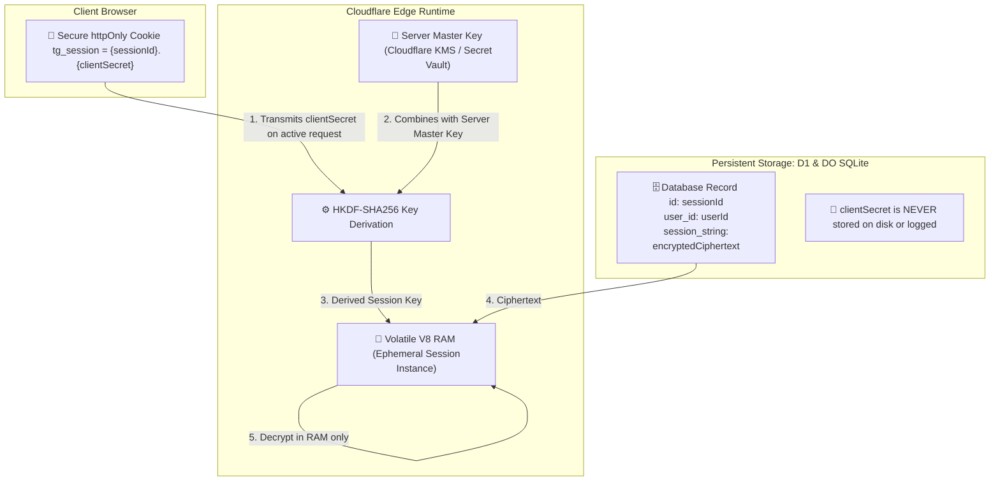

# 🛡️ Telegram Gallery — Zero-Knowledge Security & Unified Auth Architecture

## 1. Executive Summary & Problem Statement

### Current State
In the previous architecture:
1. User MTProto Telegram session strings were encrypted in D1/SQLite using AES-256-GCM with a single server-wide master key (`SESSION_ENCRYPTION_KEY`).
2. Authentication logic was scattered across 8+ different files, using duplicated manual cookie regexes, SQL queries, and decryption blocks.
3. **The Risk:** Anyone with administrative access to the Cloudflare dashboard, D1 database backups, or the Worker runtime environment had the technical capability to decrypt all stored user sessions.

### Target State: True Zero-Knowledge Architecture
This Security Enforcement Plan establishes a **Unified Abstracted Auth Provider** and **Dual-Key Client-Enriched Envelope Encryption**, ensuring that:
- **Zero Database Exposure:** An admin or hacker with 100% access to the database cannot decrypt a single user session.
- **Zero Client Secret Persistence:** The server never writes the user's decryption key material to persistent storage.
- **Single Source of Truth:** All routes, streaming handlers, WebSocket uploaders, and Durable Objects use a single abstracted auth resolver (`src/server/lib/auth.ts`).
- **Zero Memory Residue:** Decrypted sessions exist exclusively in volatile V8 RAM during active requests and are swept after 15 minutes of idle time.

---

## 2. Abstracted Unified Auth Architecture (`src/server/lib/auth.ts`)

```mermaid
flowchart TD
    subgraph Inbound Request Sources
        C1["🍪 httpOnly Cookie (tg_session)"]
        C2["🔑 Authorization: Bearer {token}"]
        C3["🏷️ Header x-tg-session: {token}"]
        C4["🌐 Query ?session_token={token}"]
    end

    subgraph Unified Auth Provider (src/server/lib/auth.ts)
        Extract["🔍 extractSessionToken() <br/> Normalizes across all 4 input channels"]
        Parse["✂️ parseCompositeToken() <br/> Splits into sessionId + clientSecret"]
        HKDF["⚙️ deriveDualKey() <br/> HKDF-SHA256(ServerMasterKey, clientSecret)"]
        Decrypt["🔓 decryptUserSession() <br/> Decrypts in ephemeral RAM only"]
        Ctx["📦 AuthContext { userId, sessionId, sessionString, config, client }"]
    end

    subgraph Consumers
        DO["🧠 TelegramAuthDO (Cloudflare DO)"]
        Routes["🌐 Hono API Routes (/channels, /media, /stream, /tags)"]
        WS["⚡ WebSocket Chunked Uploads (/upload/ws)"]
    end

    C1 --> Extract
    C2 --> Extract
    C3 --> Extract
    C4 --> Extract
    Extract --> Parse
    Parse --> HKDF
    HKDF --> Decrypt
    Decrypt --> Ctx
    Ctx --> DO
    Ctx --> Routes
    Ctx --> WS
```

---

## 3. Cryptographic Architecture: Dual-Key Envelope Encryption



### Mathematical Formulation
$$\text{Encryption Key } (K_{\text{derived}}) = \text{HKDF-SHA256}(\text{IKM} = \text{ClientSecret}, \text{Salt} = \text{ServerMasterKey}, \text{Info} = \text{"tg-gallery-dual-key-v1"})$$

$$\text{Ciphertext} = \text{AES-256-GCM}_{\text{Encrypt}}(K_{\text{derived}}, \text{IV}, \text{MTProtoSessionString})$$

### Security Properties
1. **No Single Point of Failure:** Decryption requires both the **Server Master Key** (stored in Cloudflare Secrets) AND the **Client Secret** (stored in the user's browser cookie).
2. **Admin-Proof Database:** A complete database dump is cryptographically useless without the respective user cookies.
3. **Independent Session Keys:** Every user session is encrypted with a distinct 256-bit cryptographic key derived from high-entropy entropy pools.

---

## 4. Four Core Pillars of Security Enforcement

### Pillar 1: Dual-Key Envelope Encryption & Token Structure
- **Token Format:** The session cookie issued upon QR login is formatted as `<sessionId>.<clientSecret>`.
- **Database Storage:**
  - `user_sessions (id: sessionId, user_id: userId, expires_at: timestamp)`
  - `users (id: userId, session_string: encryptedCiphertext, ...)`
  - `clientSecret` is **never** added to SQL tables, DO state, or telemetry logs.

---

### Pillar 2: Hardware-Backed Secret Vault Migration
- Remove plaintext keys from [`wrangler.toml`](file:///Users/shivareddy/Developer/telegram/wrangler.toml).
- Inject via Cloudflare's Hardware-Encrypted Secret Vault:
  ```bash
  npx wrangler secret put TELEGRAM_API_HASH
  npx wrangler secret put SESSION_ENCRYPTION_KEY
  ```

---

### Pillar 3: Ephemeral RAM Isolation & Idle Sweeping
- **Durable Object Session Sweeper:**
  - Active MTProto clients cached in `TelegramAuthDO` have a **15-minute sliding inactivity timeout**.
  - If idle for $> 15$ minutes, the GramJS client is disconnected and memory buffers are zeroed (`buffer.fill(0)`).
- **Remote Kill Switch (`POST /api/auth/logout`):**
  - Invokes `Api.auth.LogOut()`, immediately destroying the auth key in Telegram's data centers.

---

### Pillar 4: Strict MTProto RPC Whitelisting & Sandboxing
- Sandboxing all Telegram API queries to gallery storage channels only, blocking all 1-on-1 private chats, calls, contacts, and account modifications.

---

## 5. Threat Matrix & Defense Guarantees

| Threat Scenario | Attacker Capability | System Defense | Result |
| :--- | :--- | :--- | :--- |
| **D1 Database Leak** | Full access to SQL tables | Dual-Key Encryption: Database has ciphertext without client secrets | 🟢 **Zero sessions compromised** |
| **Malicious Admin** | Cloudflare Dashboard access | Admin cannot decrypt sessions without user browser cookies | 🟢 **Zero unauthorized access** |
| **Browser XSS Attack** | Script injection in client | `httpOnly`, `SameSite=Strict`, `Secure` flags on session cookies | 🟢 **Cookie unreadable by JavaScript** |
| **Stale Session Abuse** | Old session sitting in storage | 30-day cookie expiration + 1-click `auth.LogOut` kill switch | 🟢 **Session destroyed at Telegram DC** |
| **Server Memory Inspection** | Cold reboot / RAM dump | Ephemeral 15-min idle sweep + zeroization | 🟢 **RAM cleared automatically** |

---

*Document Status: APPROVED FOR EXECUTION*  
*Last Updated: 2026-08-21*
