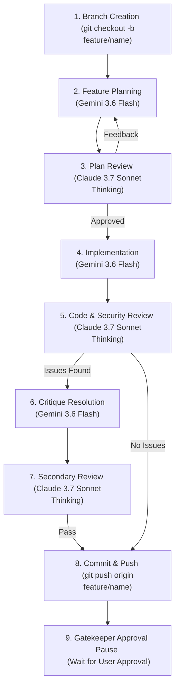

# 🤖 Antigravity Multi-Agent Development Protocol & Token-Optimization Guide

## 1. Overview & Objectives

This document defines the standard operating procedure (SOP) for building **Aetheroll** using Antigravity pair-programming agents.

To maximize execution speed, maintain zero-bug quality, and minimize context window token consumption, development is split between two distinct LLM personas across a strict 9-step feature lifecycle:

| Persona Role | Assigned Model | Key Responsibilities |
| :--- | :--- | :--- |
| **Driver (Planning & Implementation)** | **Gemini 3.6 Flash (Medium)** | Code exploration, architecture planning, feature implementation, refactoring, and test execution. |
| **Reviewer & Auditor (Plan & Code Review)** | **Claude 3.7 Sonnet (Thinking)** | Adversarial plan auditing, edge-case detection, security review, performance audit, and code diff verification. |

---

## 2. Multi-Agent 9-Step Feature Lifecycle

Every feature, bug fix, or refactor must follow this sequential lifecycle without skipping steps:



---

### Step-by-Step Execution Protocol

#### Step 1: Branch Creation
- **Model:** Gemini 3.6 Flash (Medium)
- **Action:** Before conducting deep research or making any changes, create a clean git feature branch from `main`:
  ```bash
  git checkout -b feature/<feature-name>
  ```
- **Rule:** Never write code on the `main` branch.

#### Step 2: Feature Planning
- **Model:** Gemini 3.6 Flash (Medium)
- **Action:** Inspect existing modules using targeted grep searches and slice file viewing. Draft an `implementation_plan.md` artifact detailing:
  - Technical requirements & component boundaries
  - Files to create/modify/delete
  - Verification & test strategy
- **Rule:** Do not begin modifying source code during this phase.

#### Step 3: Plan Review
- **Model:** Switch model to **Claude 3.7 Sonnet (Thinking)**
- **Action:** Audit the `implementation_plan.md` for:
  - Architectural flaws or unhandled Telegram API constraints (`FLOOD_WAIT`, rate limits).
  - Security vulnerabilities (session leaks, unencrypted keys, HWID spoofing).
  - Incomplete verification plans.
- **Rule:** If the plan has defects, Gemini 3.6 Flash updates the plan until Claude approves.

#### Step 4: Implementation
- **Model:** Switch model to **Gemini 3.6 Flash (Medium)**
- **Action:** Execute the approved plan line-by-line:
  - Write modular code using `replace_file_content` for precise diffs.
  - Run local linters and unit tests (`npm test` / `node --test`).
- **Rule:** Never declare implementation complete without passing automated test runs.

#### Step 5: Code & Security Review
- **Model:** Switch model to **Claude 3.7 Sonnet (Thinking)**
- **Action:** Perform a strict line-by-line code review of the `git diff` checking for:
  - Memory leaks (e.g. unclosed streams, missing `URL.revokeObjectURL`).
  - Logic bugs, race conditions, or unhandled promise rejections.
  - Compliance with project zero-knowledge & anti-ban rules.
- **Rule:** Provide clear, actionable critique points with line references.

#### Step 6: Critique Resolution
- **Model:** Switch model to **Gemini 3.6 Flash (Medium)**
- **Action:** Read the reviewer's critique, apply precise targeted fixes to the source code, and run tests to verify resolution.

#### Step 7: Secondary Review
- **Model:** Switch model to **Claude 3.7 Sonnet (Thinking)**
- **Action:** Re-inspect modified files to verify all critique items are cleanly resolved with zero side effects.

#### Step 8: Commit & Push
- **Model:** Gemini 3.6 Flash (Medium)
- **Action:** Stage changes, write conventional commit messages, and push the feature branch to remote:
  ```bash
  git add .
  git commit -m "feat(<scope>): <description>"
  git push origin feature/<feature-name>
  ```

#### Step 9: Gatekeeper Approval Pause
- **Model:** Gemini 3.6 Flash (Medium)
- **Action:** Stop tool execution and request user approval.
- **Rule:** Do **NOT** start planning or coding the next feature until the user explicitly approves the current feature branch.

---

## 3. Token-Optimization & Efficiency Guidelines

To avoid exceeding model context limits and minimize token consumption in Antigravity:

### 1. Targeted Code Inspection (No File Dumps)
- **Do NOT** view entire 1,000-line files.
- Use `grep_search` with specific queries to locate exact line numbers.
- Use `view_file` with precise `StartLine` and `EndLine` parameters to read only relevant chunks (e.g., 30–50 lines).

### 2. Precise File Edits with `replace_file_content`
- **Never** replace an entire file with `write_to_file` when making minor edits.
- Use `replace_file_content` targeting small, contiguous code blocks.
- Ensure `TargetContent` includes exact indentations to avoid duplicate match errors.

### 3. Artifact Context Hygiene
- When creating or modifying markdown artifacts (`implementation_plan.md`, `walkthrough.md`), do **NOT** re-summarize their contents in the chat window.
- The UI renders artifacts automatically for the user; chat output must remain 1–3 sentences max.

### 4. Delegation to Subagents
- For heavy, multi-file code research or log analysis, spawn a lightweight subagent (`invoke_subagent` with `flash` or `research` model).
- The subagent context is discarded after reporting back, keeping the primary agent's token context lean and focused.

---

## 4. Project-Specific Architectural Guardrails

All code generated by agents in this repository must comply with these non-negotiable rules:

1. **Zero-Knowledge Envelope Encryption:**
   - User MTProto session strings must **never** be stored in plaintext.
   - Dual-key derivation (`HKDF-SHA256`) using Server Master Key + Client Secret cookie is required for all stored sessions.

2. **Anti-Ban Pacing & Flood Protection:**
   - Ingestion uploads must execute sequentially with an artificial pacing delay (4,000ms minimum between uploads).
   - `FLOOD_WAIT` exceptions must pause the queue for the exact penalty duration returned by Telegram.

3. **Memory Management:**
   - EPHEMERAL V8 RAM only for active sessions (15-minute sliding idle timeout before memory zeroization).
   - Front-end image/video Blob URLs must call `URL.revokeObjectURL` immediately upon viewer unmount.

---

## 5. Quick Command Reference for Agents

```bash
# 1. Create & switch to feature branch
git checkout -b feature/<feature-name>

# 2. Run unit tests
npm test

# 3. Check git status & diff
git status -s
git diff

# 4. Commit & push
git add .
git commit -m "feat(scope): detailed description"
git push origin feature/<feature-name>
```
