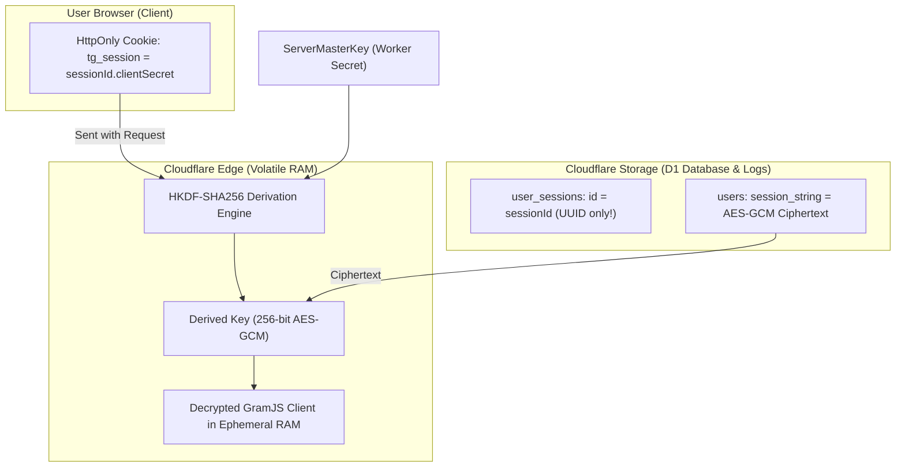
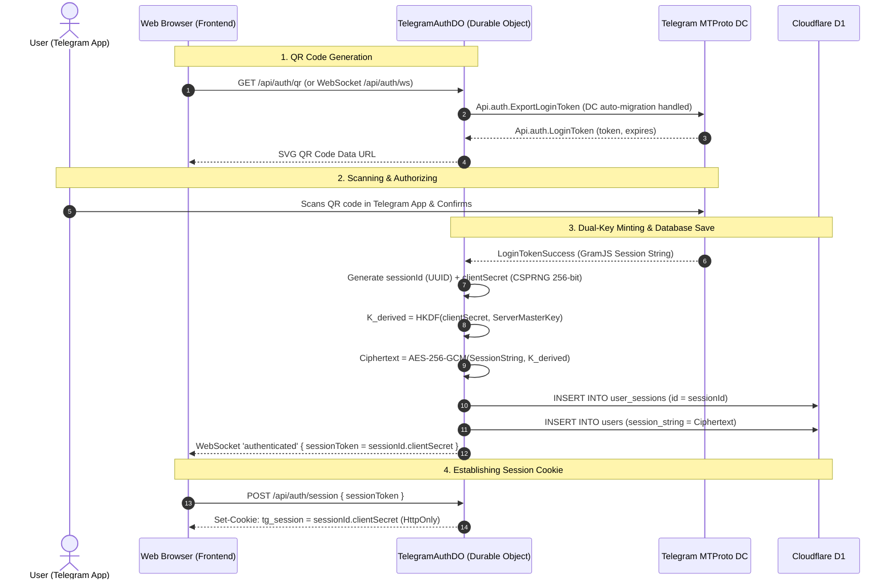

# 🛡️ Telegram Gallery: Zero-Knowledge Dual-Key Authentication & Security Architecture

> **Audience**: Future maintainers, security auditors, and core contributors.  
> **Status**: Production Standard (Cloudflare Workers, Durable Objects, D1 Database).  
> **Primary Source Code**: [`src/server/lib/crypto.ts`](file:///Users/shivareddy/Developer/telegram/src/server/lib/crypto.ts), [`src/server/lib/auth.ts`](file:///Users/shivareddy/Developer/telegram/src/server/lib/auth.ts), [`src/server/durable_objects/TelegramAuthDO.ts`](file:///Users/shivareddy/Developer/telegram/src/server/durable_objects/TelegramAuthDO.ts).

---

## 1. Executive Summary & Core Security Principles

Telegram user accounts authenticate via MTProto String Sessions (GramJS). An unencrypted Telegram String Session allows full access to a user's Telegram account. 

### The Threat We Eliminated (The "Admin / DB Leak" Threat)
In conventional single-key server encryption:
- If a server administrator, rogue employee, or attacker gains read access to the database (D1/SQLite) and the server's environment variables (`SESSION_ENCRYPTION_KEY`), they can decrypt every user's Telegram session and compromise their private chats.

### Our Solution: Zero-Knowledge Dual-Key Envelope Encryption
We split the encryption key into two independent halves:
1. **Server Master Key ($K_{\text{server}}$)**: Stored strictly in Cloudflare Worker encrypted secrets / environment variables.
2. **Client Secret ($K_{\text{client}}$)**: Stored **only in the user's browser** (`HttpOnly` cookie and `localStorage`). **Never persisted to D1, SQLite, disk, or server logs.**



---

## 2. Cryptographic Specification

### 2.1 Key Derivation Function (HKDF-SHA256)
When an authenticated request arrives, the server derives an ephemeral 256-bit AES key using Web Crypto HKDF:

$$\text{DerivedKey} = \text{HKDF-SHA256}\Big(\text{IKM} = K_{\text{client}},\, \text{Salt} = K_{\text{server}},\, \text{Info} = \text{"tg-gallery-dual-key-v1"}\Big)$$

- **IKM (Input Keying Material)**: 256-bit random client secret (64 hex chars).
- **Salt**: 256-bit server master key.
- **Info**: `"tg-gallery-dual-key-v1"` (Domain separation tag).
- **Output Length**: 256 bits (32 bytes).

### 2.2 Symmetric Encryption (AES-256-GCM)
- **Algorithm**: `AES-GCM` (Authenticated Encryption with Associated Data).
- **IV (Initialization Vector)**: 96-bit (12 bytes) cryptographically secure random bytes generated per encryption.
- **Auth Tag**: 128-bit (16 bytes) integrity tag.
- **Stored Ciphertext Format**:
  ```text
  Base64( IV [12 bytes] + AuthTag [16 bytes] + Ciphertext [N bytes] )
  ```

---

## 3. Session Token Anatomy & Storage Separation

### 3.1 Composite Session Token Structure
When a user logs in via QR code, the backend generates a composite token:

$$\text{SessionToken} = \underbrace{\text{sessionId}}_{\text{UUIDv4 (36 chars)}} \mathbin{.} \underbrace{\text{clientSecret}}_{\text{256-bit Hex (64 chars)}}$$

*Example*:
`f5601b43-06c8-472e-8e6f-e3c3ec12b001.a1b2c3d4e5f67890123456789abcdef0a1b2c3d4e5f67890123456789abcdef0`

### 3.2 Storage Breakdown

| Entity | Client Browser | Cloudflare D1 Database | Durable Object SQLite | Server Logs |
| :--- | :---: | :---: | :---: | :---: |
| **`sessionId` (UUID)** | ✅ (`tg_session` cookie) | ✅ (`user_sessions.id`) | ❌ | ✅ (Anonymous metrics) |
| **`clientSecret` (Hex)** | ✅ (`tg_session` cookie) | 🚫 **NEVER** | 🚫 **NEVER** | 🚫 **NEVER** |
| **Server Master Key** | 🚫 **NEVER** | 🚫 **NEVER** | 🚫 **NEVER** | 🚫 **NEVER** (CF Secrets) |
| **Telegram Plaintext String** | 🚫 **NEVER** | 🚫 **NEVER** | 🚫 **NEVER** | 🚫 **NEVER** |
| **Encrypted Ciphertext** | 🚫 **NEVER** | ✅ (`users.session_string`) | ❌ | 🚫 **NEVER** |

---

## 4. Unified Abstracted Auth Architecture

To prevent scattered authentication logic, all authentication, token extraction, and session resolution are centralized in [`src/server/lib/auth.ts`](file:///Users/shivareddy/Developer/telegram/src/server/lib/auth.ts).

### 4.1 Token Extraction (`extractSessionToken`)
Normalizes authentication tokens across all protocols:
1. **`tg_session` Cookie**: Extracted from standard HTTP cookie headers.
2. **`Authorization: Bearer <token>`**: Extracted from standard Bearer headers.
3. **`x-tg-session: <token>`**: Extracted for cross-origin / custom API requests.
4. **`?session_token=` Query Param**: Extracted for media streaming `<video>` and `` tags.
5. **Raw String**: Direct string support for POST body handshakes.

```typescript
export function extractSessionToken(source: any): ParsedSessionToken | null {
  // Returns: { fullToken, sessionId, clientSecret }
}
```

### 4.2 Unified Resolver (`resolveUserAuth`)
A single asynchronous call used by all API routes:

```typescript
const auth = await resolveUserAuth(c);
if (!auth.authenticated || !auth.sessionString) {
  return c.text("Unauthorized", 401);
}

// Reuse warm MTProto client connection
const client = await getConnectedClient(auth.sessionString, auth.telegramConfig);
```

---

## 5. Authentication Lifecycle & State Transitions



---

## 6. Zero-Downtime Legacy Session Backward Compatibility

When an existing user visits the application with an older single-key session:
1. **Detection**: `extractSessionToken` finds no `.` in the token, setting `sessionId = token`, `clientSecret = undefined`.
2. **Fallback Decryption**: `getCryptoKey` recognizes `clientSecret === undefined` and computes `SHA-256(ServerMasterKey)`, successfully decrypting the legacy session.
3. **Automatic Upgrade**: The next time the user logs out and scans the QR code, their account is automatically upgraded to the Zero-Knowledge Dual-Key format.

---

## 7. Threat Model & Security Guarantees

### Threat 1: Full D1 Database Dump Leak
- **Scenario**: An attacker obtains a full SQL dump of the D1 database.
- **Impact**: **Zero Telegram accounts compromised.** The attacker only has `sessionId` and `Ciphertext`. Without the respective users' `clientSecret` (which only exists in user cookies), mathematical decryption of AES-256-GCM is infeasible.

### Threat 2: Cloudflare Dashboard / Admin Secret Compromise
- **Scenario**: A malicious administrator or attacker gains access to Cloudflare Worker secrets (`SESSION_ENCRYPTION_KEY`).
- **Impact**: **Zero Telegram accounts compromised.** `ServerMasterKey` alone cannot decrypt any user's session without the corresponding `clientSecret`.

### Threat 3: Ephemeral RAM Isolation & 15-Minute Sliding Inactivity Sweeper
- **Scenario**: Worker RAM memory persistence.
- **Mitigation**: MTProto clients in `TelegramAuthDO.ts` are tracked with timestamps. A sliding 15-minute inactivity sweeper terminates idle MTProto connections and purges plaintext sessions from volatile RAM.

---

## 8. File & Module Reference

| File | Purpose |
| :--- | :--- |
| [`src/server/lib/crypto.ts`](file:///Users/shivareddy/Developer/telegram/src/server/lib/crypto.ts) | Web Crypto HKDF-SHA256 key derivation & AES-256-GCM encryption/decryption. |
| [`src/server/lib/auth.ts`](file:///Users/shivareddy/Developer/telegram/src/server/lib/auth.ts) | Unified Abstracted Auth Provider: token extraction, composite token generation, and user resolution. |
| [`src/server/lib/telegram.ts`](file:///Users/shivareddy/Developer/telegram/src/server/lib/telegram.ts) | GramJS MTProto client management, DC domain SSL enforcement, and QR export/migration. |
| [`src/server/durable_objects/TelegramAuthDO.ts`](file:///Users/shivareddy/Developer/telegram/src/server/durable_objects/TelegramAuthDO.ts) | Stateful Durable Object handling WebSocket QR auth, upload streaming, and RAM sweeping. |
| [`src/server/routes/auth.ts`](file:///Users/shivareddy/Developer/telegram/src/server/routes/auth.ts) | Auth API routes (`/qr`, `/check`, `/session`, `/me`, `/logout`). |
| [`tests/dual_key_auth.test.ts`](file:///Users/shivareddy/Developer/telegram/tests/dual_key_auth.test.ts) | Automated unit test suite verifying HKDF derivation, leak resistance, and token parsers. |
| [`SECURITY_ENFORCEMENT_PLAN.md`](file:///Users/shivareddy/Developer/telegram/SECURITY_ENFORCEMENT_PLAN.md) | High-level security enforcement roadmap. |
