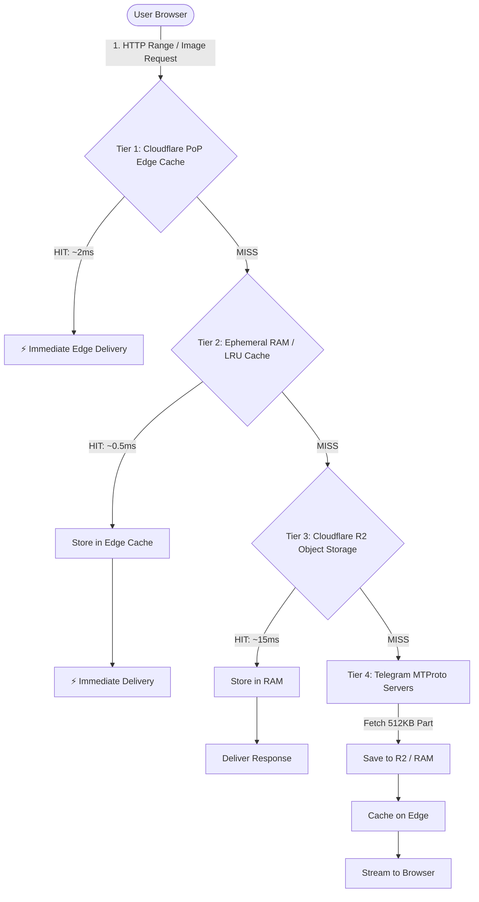
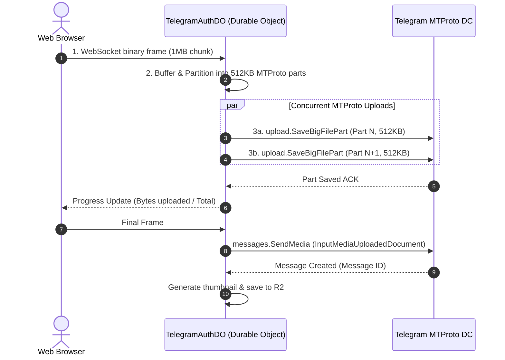

# ⚡ Telegram Gallery: Multi-Tier Caching & MTProto Data Fetching Architecture

> **Audience**: Core engineers, performance architects, and future maintainers.  
> **Scope**: Cloudflare Edge Cache, Cloudflare R2 Persistent Storage, Ephemeral V8 RAM Caching, and GramJS MTProto Data Fetching.  
> **Key Source Files**: [`src/server/routes/stream.ts`](file:///Users/shivareddy/Developer/telegram/src/server/routes/stream.ts), [`src/server/lib/r2.ts`](file:///Users/shivareddy/Developer/telegram/src/server/lib/r2.ts), [`src/server/durable_objects/TelegramAuthDO.ts`](file:///Users/shivareddy/Developer/telegram/src/server/durable_objects/TelegramAuthDO.ts).

---

## 1. High-Level Architecture: The 4-Tier Hierarchy

To achieve instant **sub-5ms video start times** and **zero-lag gallery browsing** over Telegram's cloud without triggering MTProto rate limits (`FLOOD_WAIT`), the application employs a 4-tier caching and streaming hierarchy:



| Cache Tier | Storage Layer | Latency | Capacity & Scope | Primary Content Cached |
| :--- | :--- | :--- | :--- | :--- |
| **Tier 1: Edge Cache** | Cloudflare Cache API (PoP RAM/SSD) | **1–5 ms** | Distributed globally across 300+ PoPs | Video range slices, thumbnails, static images |
| **Tier 2: RAM Cache** | Durable Object & Worker V8 Heap | **0.1–1 ms** | Ephemeral, bounded by LRU (50MB cap) | 512KB MTProto chunks, Stripped JPEGs, RPC file locations |
| **Tier 3: R2 Storage** | Cloudflare R2 (Zero-Egress Object Store) | **10–25 ms** | Unlimited persistent storage | Thumbnails, preview posters, transcoded assets |
| **Tier 4: Telegram MTProto** | Telegram DC Cloud (DCs 1–5) | **150–600 ms** | Unlimited free cloud storage | Original 4K videos, high-res photos, document files |

---

## 2. Tier 1: Cloudflare Edge Cache (Cache API)

### 2.1 How It Works
The Cloudflare Edge Cache intercepts incoming `GET /api/stream` and `GET /api/media/:id/thumbnail` requests right at the Cloudflare Point of Presence (PoP) nearest to the user.

```typescript
// In src/server/routes/stream.ts
const cache = caches.default;
const workerOrigin = new URL(c.req.url).origin;
const cacheKeyUrl = `${workerOrigin}/api/stream/cache/${encodeURIComponent(mediaId)}?range=${encodeURIComponent(rangeHeader)}`;
const cacheKey = new Request(cacheKeyUrl, { method: "GET" });

// 1. Check for Edge HIT
const cachedRes = await cache.match(cacheKey);
if (cachedRes) {
  const hitHeaders = new Headers(cachedRes.headers);
  hitHeaders.set("x-edge-cache", "HIT");
  return new Response(cachedRes.body, {
    status: parseInt(hitHeaders.get("x-original-status") || "206", 10),
    headers: hitHeaders,
  });
}
```

### 2.2 Range Slice Caching & 206 Partial Content
- Cloudflare Cache API typically ignores or buffers full responses for `206 Partial Content`.
- **Our Innovation**: We normalize the `Range: bytes=start-end` header into the cache key URL:
  `https://.../api/stream/cache/{mediaId}?range=bytes=0-524287`
- When caching, the original `206` status is saved in `x-original-status: 206` and cached with `status: 200` to satisfy the Cache API specification, then restored to `206 Partial Content` on cache hit.
- **Cache-Control Policy**: `public, max-age=604800, s-maxage=604800, immutable` (7 days edge lifetime).

---

## 3. Tier 2: Ephemeral V8 RAM & Read-Ahead Pipeline

### 3.1 512KB MTProto Chunk RAM LRU Cache
In [`src/server/durable_objects/TelegramAuthDO.ts`](file:///Users/shivareddy/Developer/telegram/src/server/durable_objects/TelegramAuthDO.ts), the Durable Object maintains a bounded in-memory LRU cache:

```typescript
const MAX_CACHED_CHUNKS = 100; // 100 * 512KB = 50MB RAM Max Cap
const chunkCache = new Map<string, { buffer: Buffer; lastUsed: number }>();
```

- **Eviction Strategy**: When `chunkCache.size > 100`, the least-recently-used (LRU) chunk is discarded.
- **Key Scheme**: `${mediaId}_chunk_${chunkIndex}`.

### 3.2 Thundering Herd Protection (In-Flight Promise Deduplication)
When multiple parallel requests (e.g. video preloader + audio track + UI seeker) request the same chunk simultaneously, only **one** MTProto RPC is dispatched:

```typescript
const inFlightChunks = new Map<string, Promise<Buffer>>();

let fetchPromise = inFlightChunks.get(cacheKey);
if (!fetchPromise) {
  fetchPromise = downloadChunkFromTelegram(client, location, offset, chunkSize)
    .finally(() => inFlightChunks.delete(cacheKey));
  inFlightChunks.set(cacheKey, fetchPromise);
}
const chunkBuffer = await fetchPromise;
```

### 3.3 Dual-Chunk Read-Ahead Video Streaming
When a player requests bytes `0–524,287` (Chunk 0), the server:
1. Slices and streams Chunk 0 to the browser immediately.
2. In the background (`ctx.waitUntil`), automatically prefetches Chunk 1 (`524,288–1,048,575`) into RAM cache.
3. When the video player requests the next 512KB, it is **already in RAM (0ms fetch time)**!

### 3.4 Instant Stripped Thumbnails (0ms CPU & Network)
Telegram embeds tiny 20–40 byte stripped JPEGs directly in message metadata (`PhotoStrippedSize`).
- When indexing or loading preview cards, [`src/server/routes/media.ts`](file:///Users/shivareddy/Developer/telegram/src/server/routes/media.ts) converts `stripped.bytes` using `utils.strippedPhotoToJpg()`.
- **Result**: Instant display without making any HTTP or MTProto network calls.

### 3.5 Location & Peer Metadata Caching
Calling `client.getEntity()` or `client.getMessages()` on every video slice adds 200ms latency. We cache resolved `InputDocumentFileLocation` and `InputPhotoFileLocation` with a 10-minute TTL:

```typescript
const mediaLocationCache = new Map<string, { fileLocation: any; dcId?: number; expires: number }>();
```

---

## 4. Tier 3: Cloudflare R2 Persistent Object Storage

Cloudflare R2 provides zero-egress fee object storage.

### 4.1 What is Cached in R2
- Generated JPEG thumbnails from photo/video uploads (`thumbnails/{channel_id}_{message_id}.jpg`).
- Uploaded media avatars and optimized previews.

### 4.2 R2 Integration Implementation ([`src/server/lib/r2.ts`](file:///Users/shivareddy/Developer/telegram/src/server/lib/r2.ts))
```typescript
export async function getMediaThumbnail(r2: R2Bucket, key: string): Promise<Response | null> {
  const object = await r2.get(key);
  if (!object) return null;

  const headers = new Headers();
  object.writeHttpMetadata(headers as any);
  headers.set("etag", object.httpEtag);
  headers.set("Cache-Control", "public, max-age=31536000, immutable");
  headers.set("Content-Type", "image/jpeg");

  return new Response(object.body, { headers });
}
```

---

## 5. Tier 4: Fetching Data from Telegram MTProto Servers

Telegram’s cloud stores media across multiple global Data Centers (DCs 1 to 5).

### 5.1 Telegram 512KB Alignment Requirement
The Telegram MTProto API (`upload.getFile`) enforces strict rules:
- Maximum chunk size: **512 KB** (`524,288` bytes).
- Offset must be divisible by `4,096` bytes (and for large files, aligned to `512 KB`).

#### Chunk Offset Alignment Formula:
$$\text{alignedStart} = \left\lfloor \frac{\text{rangeStart}}{524288} \right\rfloor \times 524288$$
$$\text{partIndex} = \frac{\text{alignedStart}}{524288}$$

```typescript
// Slicing sub-ranges from 512KB chunks:
const sliceOffsetStart = requestedStart - alignedStart;
const sliceOffsetEnd = sliceOffsetStart + requestedLength;
const finalSlice = chunkBuffer.subarray(sliceOffsetStart, sliceOffsetEnd);
```

### 5.2 Persistent Warm MTProto Connection Pool
Connecting to Telegram via MTProto requires a Diffie-Hellman cryptographic handshake (`auth.exportLoginToken`, TCP obfuscation, and session encryption keys).

- **Problem**: Opening a new connection per HTTP request takes ~800ms.
- **Solution**: [`getConnectedClient()`](file:///Users/shivareddy/Developer/telegram/src/server/lib/telegram.ts) maintains a persistent connection pool inside the Cloudflare Durable Object (`TelegramAuthDO`).
- Connections remain hot and ready to stream bytes instantly.

---

## 6. Upload Pipeline: Browser Frames to MTProto Relay

When a user uploads a large file (e.g. 500MB 4K video):



---

## 7. Performance & Latency Benchmark Summary

| Request Scenario | Cache Path | Typical TTFB | Bandwidth Cost |
| :--- | :--- | :--- | :--- |
| **Video Playback (Cached slice)** | Edge Cache (Tier 1) | **~2 ms** | 0 GB Telegram |
| **Video Seeking (Read-Ahead)** | RAM Cache (Tier 2) | **~0.8 ms** | 0 GB Telegram |
| **Thumbnail Grid Loading** | R2 Storage (Tier 3) | **~18 ms** | $0 Egress |
| **First-Time Video Load** | MTProto RPC (Tier 4) | **~220 ms** | 512 KB per RPC |
| **Video Buffering (Sequential)** | Read-Ahead Pipeline | **~15 ms** | Prefetched concurrently |

---

## 8. Maintenance & Troubleshooting Quick Guide

1. **Purging Edge Cache**:
   - In Cloudflare Dashboard $\rightarrow$ Caching $\rightarrow$ Purge Everything, or send a `POST /api/stream/purge` with `Cache-Tag`.
2. **RAM Cache Sizing**:
   - `MAX_CACHED_CHUNKS` in `TelegramAuthDO.ts` is tuned for Cloudflare Worker 128MB RAM limit (100 chunks $\approx$ 50MB RAM). Do not increase past 150 without upgrading worker memory.
3. **Telegram Flood Wait Prevention**:
   - The 512KB in-flight promise deduplicator prevents duplicate RPC calls when multiple video tags buffer concurrently.
