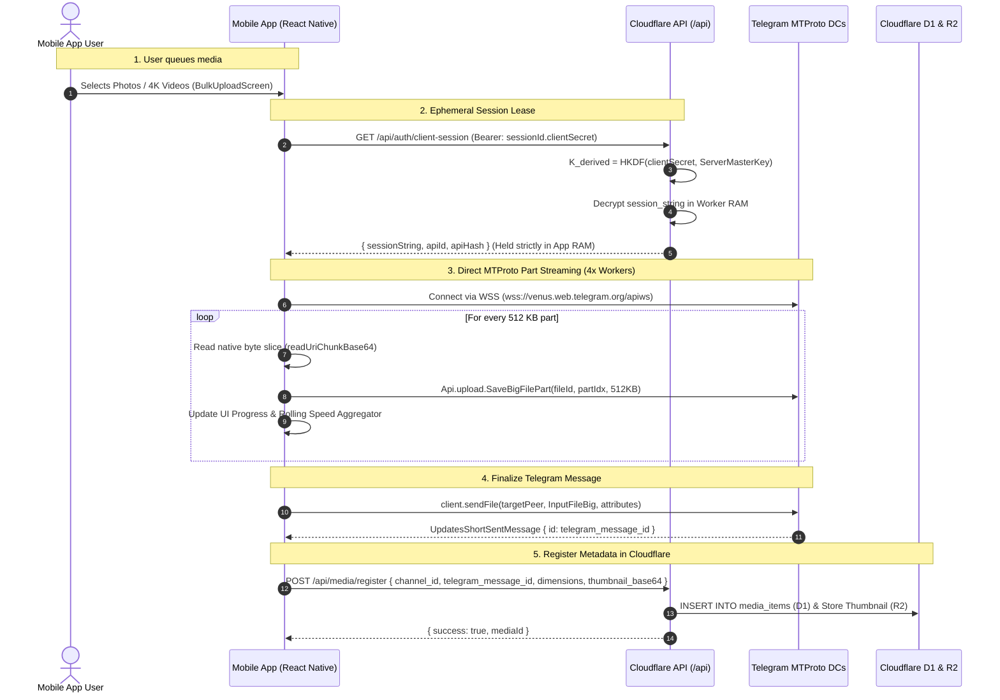

# Direct Mobile-to-Telegram Upload & Zero-Knowledge Architecture

## 1. Executive Summary

Aetheroll employs a **Hybrid Zero-Knowledge Upload Architecture** combining direct client-to-datacenter media streaming with centralized metadata and index synchronization:

1. **Direct MTProto Upload (App $\rightarrow$ Telegram)**: The mobile app connects directly to Telegram Core Data Centers via secure WebSockets (`wss://`), streaming 512 KB binary parts across 4 concurrent worker threads.
2. **Zero-Knowledge Ephemeral Lease**: The Telegram MTProto session string is encrypted at rest in Cloudflare D1 using a dual key derived from both the server master key and the client-side secret. The decrypted session string is leased exclusively into **volatile client RAM** on demand and is **never written to disk**.
3. **Dynamic Upload Engine Router**: An abstraction layer supporting three modes (`auto`, `direct`, `cloudflare`). In `auto` mode, the app uses direct MTProto uploads and automatically falls back to Cloudflare proxy endpoints if Telegram ports or MTProto handshakes are blocked by local network firewalls.
4. **Cloudflare Metadata Ledger**: Once Telegram assigns a `telegram_message_id`, the mobile app registers metadata (dimensions, duration, thumbnail, blurhash, EXIF) via `POST /api/media/register` into Cloudflare D1 and R2.

---

## 2. Secrets & Key Lifecycle (Zero-Knowledge Invariant)

### 2.1 Secret Classification & Storage Table

| Secret / Credential | Scope & Storage Location | Persisted to Disk? | Thrown Away / Reset When? |
| :--- | :--- | :--- | :--- |
| **`clientSecret`** (Hex 64 chars) | Stored in mobile **Android KeyStore** / **iOS Keychain** + `AsyncStorage` as part of `sessionId.clientSecret`. | **Yes (Hardware KeyStore)** | **Only on Logout**. It is the user's permanent cryptographic authorization factor. |
| **`ServerMasterKey`** | Stored exclusively as a Cloudflare Worker secret (`SESSION_ENCRYPTION_KEY`). | **Yes (Cloudflare Secrets)** | Server secret; never leaves Cloudflare infrastructure. |
| **`Ciphertext`** (Encrypted Session) | Stored in Cloudflare D1 (`users.session_string`). | **Yes (D1 Database)** | Updated upon account re-auth. Uncrackable without `clientSecret`. |
| **`sessionString`** (Decrypted Plaintext) | Held **exclusively in volatile RAM** in `MobileTelegramClientManager`. | 🚫 **NEVER** | **Destroyed on process death, memory pressure, app kill, or logout.** Re-leased via `GET /api/auth/client-session` when app restarts. |
| **Upload `fileId` & Part Buffers** | In-flight upload session memory inside `DirectTelegramUploader`. | 🚫 **NEVER** | **Garbage collected immediately** upon upload completion or abort. |

### 2.2 Answering: "Does the client throw away the secret when upload finishes?"
* **`clientSecret`**: **Kept** in the secure hardware keychain. This is your account login key. Throwing it away would immediately log the user out of the app.
* **`sessionString`**: **Kept in volatile RAM only** for the lifetime of the active app process / Android Foreground Service so subsequent photos in a bulk queue can upload instantly without repeated `/client-session` roundtrips. It is **never saved to disk** and is wiped as soon as the OS terminates the app process.
* **Part Buffers & Slices**: **Thrown away immediately** after each 512 KB part is acknowledged by Telegram's DCs.

---

## 3. End-to-End Architectural Flow



---

## 4. Component Structure

### 4.1 Mobile Client Services (`apps/mobile/src/services/`)

```
apps/mobile/src/services/
├── backup/
│   ├── backupManager.ts          # Central queue orchestrator & state machine
│   ├── uploadDispatcher.ts       # Sliding-window concurrency & pacer controller
│   ├── uploadStrategy.ts         # Dynamic Strategy Router (Auto, Direct, Cloudflare)
│   ├── directTelegramUploader.ts # Direct MTProto 512 KB part streaming engine
│   ├── chunkedUploader.ts        # Cloudflare 4 MB chunk proxy pipeline
│   ├── xhrUploader.ts            # Fast single-shot HTTP proxy pipeline (<=15MB)
│   ├── ratePacer.ts              # Adaptive FLOOD_WAIT penalty & rate controller
│   ├── queueStorage.ts           # Persistent backup queue (WatermelonDB / Storage)
│   └── nativeBackgroundService.ts# Android Foreground Service & Native chunking bridge
└── telegram/
    └── telegramClient.ts         # In-memory GramJS singleton & session lease manager
```

### 4.2 Dynamic Upload Strategy Router (`uploadStrategy.ts`)

The strategy router abstracts the upload execution behind a unified signature:

```typescript
export type UploadEngineMode = 'auto' | 'direct' | 'cloudflare';

UploadStrategyRouter.uploadItem(item, signal, onProgress);
```

* **`auto` (Default)**: Tries `DirectTelegramUploader`. If Telegram DCs are unreachable or firewalled, catches the network error and automatically delegates to `ChunkedUploader` / `XhrUploader` without interrupting the user's queue.
* **`direct`**: Forces direct MTProto streaming directly to Telegram DCs.
* **`cloudflare`**: Forces routing through Cloudflare Durable Object proxy endpoints.

---

## 5. Mobile Native & Polyfill Architecture

React Native uses the Hermes engine and does not provide Node core built-ins (`util`, `crypto`, `net`, `tls`). The Metro configuration ([`metro.config.js`](file:///Users/shivareddy/Developer/telegram/apps/mobile/metro.config.js)) resolves these via:

1. **`node-libs-react-native`**: Polyfills `util`, `events`, `stream`, `buffer`, `path`.
2. **`crypto-browserify`**: Polyfills cryptographic primitives for GramJS authentication.
3. **`emptyMock.js`**: Safely stubs unsupported raw Node networking (`net`, `tls`, `fs`).
4. **`useWSS: true`**: Instructs GramJS to use React Native's native `WebSocket` implementation over TLS (`wss://`) on port 443.

---

## 6. Guidelines for Future Agent Modifications

1. **Preserve Zero-Knowledge Invariants**:
   - Never write `sessionString` or `clientSecret` to plaintext databases, server telemetry logs, or local storage.
2. **Preserve UI/UX Contract**:
   - All upload engines must report progress through `onProgress(uploadedBytes, totalBytes, percent)`.
   - Never bypass the `RatePacer.waitIfNeeded()` check before dispatching Telegram MTProto calls.
3. **Respect Channel Peer Resolution**:
   - The queue operates on internal D1 channel UUIDs (`item.channelId`).
   - When communicating directly with Telegram, resolve the D1 UUID to the corresponding `telegram_channel_id` before invoking `client.sendFile()`.
