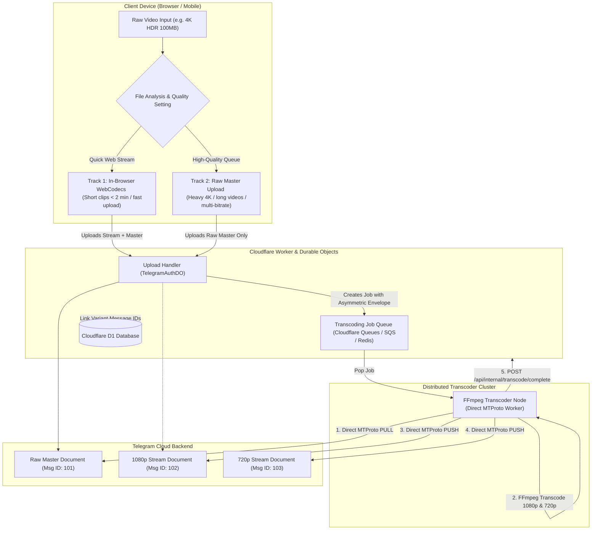
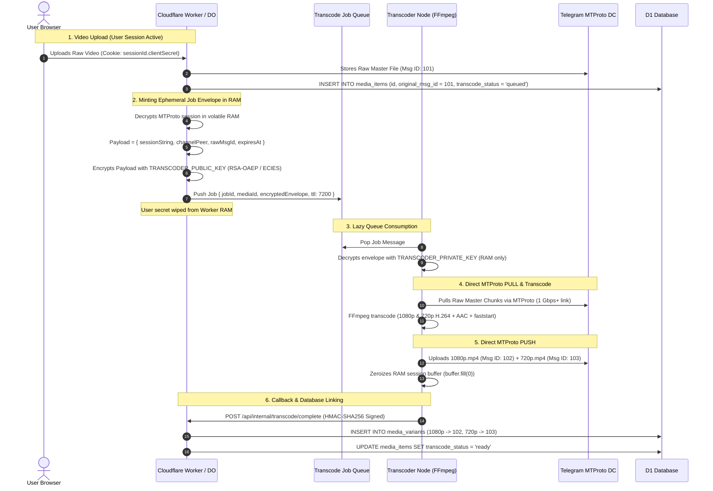

# Dual-Track Multi-Variant Video Transcoding Architecture
## Zero-Knowledge Dual-Key Authentication, In-Browser WebCodecs & Distributed Queue Pipeline

> **Document Status**: DRAFT / ARCHITECTURAL SPECIFICATION  
> **Target Environment**: Cloudflare Workers, Durable Objects, D1 Database, Cloudflare Queues / Redis, Distributed FFmpeg Workers.  
> **Related Specifications**: [`AUTH_AND_SECURITY_ARCHITECTURE.md`](file:///Users/shivareddy/Developer/telegram/docs/AUTH_AND_SECURITY_ARCHITECTURE.md), [`CACHING_AND_DATA_FETCHING_ARCHITECTURE.md`](file:///Users/shivareddy/Developer/telegram/docs/CACHING_AND_DATA_FETCHING_ARCHITECTURE.md).

---

## 1. Executive Summary & Problem Statement

Modern mobile and camera devices capture video at extremely high bitrates and complex formats:
* **High Bitrate**: A 20-second 4K video is ~90–120 MB (≈ 40–50 Mbps).
* **Codec Incompatibility**: Captured in **10-bit HEVC (H.265), Dolby Vision Profile 8.4 HDR, or Apple ProRes**, which many desktop browsers (Chrome on Windows/Linux) cannot decode natively.
* **Network Buffering**: Streaming 45+ Mbps over HTTP Range requests causes continuous buffering on mobile networks, high data consumption, and rapid battery drain.

### The Conflict
* **Option A (Destructive Transcode Only)**: Downsamples and compresses video to 1080p SDR, permanently destroying the original 4K HDR master.
* **Option B (Raw Master Only)**: Uploads untouched raw files, causing browser codec failures and severe playback buffering.

### The Solution: Multi-Variant Dual-Track Architecture
Aetheroll leverages Telegram's **free, unlimited cloud storage** to store the **original master alongside multiple web-streamable variants**:
1. **Asset 1: Original Raw Master** (4K HDR / ProRes untouched file for archival & lossless download).
2. **Asset 2+: Transcoded Web Stream Variants** (1080p, 720p, 480p H.264/AAC with faststart headers for instant sub-100ms playback).

---

## 2. Dual-Track Transcoding Pipeline Overview

To balance cost, speed, and device capabilities, Aetheroll operates a **Dual-Track Transcoding Pipeline**:



* **Track 1 (Client-Side WebCodecs)**: Instant local hardware acceleration (using WebCodecs API + `mp4-muxer`) for short clips (< 2 min), encoding 1080p in 1–2 seconds with zero server compute costs.
* **Track 2 (Distributed Cloud Queue Transcoder)**: Asynchronous background worker using FFmpeg for heavy 4K HDR files, long duration videos, and multi-resolution ladder generation (1080p, 720p, 480p).

---

## 3. Dual-Key Zero-Knowledge Security for Asynchronous Queues

### 3.1 The Security Dilemma
In Aetheroll’s Zero-Knowledge architecture:
- $K_{\text{server}}$ is in Cloudflare Secrets.
- $K_{\text{client}}$ exists **exclusively in the user's browser cookie/header** (`sessionId.clientSecret`) and is **never written to D1, disk, or logs**.
- Decrypted MTProto sessions exist only in ephemeral Worker RAM and are swept after 15 minutes.

When a transcoding job is queued and processed asynchronously hours later (or when the user is offline), **the database cannot supply the user's decryption secret**.

### 3.2 Asymmetric Ephemeral Job Envelope Protocol
To solve this, the API Worker mints a **short-lived, job-scoped encrypted envelope** inside the queue message payload at the moment of upload:



### 3.3 Threat Model & RAM Security Analysis

| Threat Scenario | Attacker Capability | System Defense | Result |
| :--- | :--- | :--- | :--- |
| **D1 Database Dump** | Full SQL table dump | Database contains only ciphertext and no client secrets or job envelopes. | 🟢 **Zero accounts compromised** |
| **Cloudflare Secret Compromise** | Access to `SESSION_ENCRYPTION_KEY` | Attacker lacks user `clientSecret` and cannot decrypt offline sessions. | 🟢 **Zero accounts compromised** |
| **Transcoder Queue Inspection** | Read access to queue messages | Envelopes are encrypted with Transcoder Public Key; unreadable without Private Key. | 🟢 **Zero credentials leaked** |
| **Live RAM Inspection on Active Job** | Root/kernel access to Transcoder memory during transcoding | **Blast Radius = 1**: Attacker can only see the single active job's session; cannot compromise other users or offline accounts. Memory is zeroed (`buffer.fill(0)`) immediately upon job completion. | 🟡 **Strictly isolated to 1 job** |
| **Confidential Computing (Optional)** | Physical hypervisor snooping | Running Transcoder on AMD SEV-SNP / AWS Nitro Enclaves encrypts RAM hardware bus. | 🟢 **Hardware RAM encrypted** |

---

## 4. Database Schema Evolution (Cloudflare D1)

```sql
-- Migration: 0005_media_variants.sql

-- 1. Dedicated Multi-Variant Storage Table
CREATE TABLE media_variants (
    id TEXT PRIMARY KEY,
    media_item_id TEXT NOT NULL REFERENCES media_items(id) ON DELETE CASCADE,
    quality TEXT NOT NULL CHECK(quality IN ('1080p', '720p', '480p', '360p')),
    telegram_message_id INTEGER NOT NULL,
    file_size_bytes INTEGER NOT NULL,
    width INTEGER NOT NULL,
    height INTEGER NOT NULL,
    bitrate_kbps INTEGER,
    mime_type TEXT NOT NULL DEFAULT 'video/mp4',
    codec TEXT NOT NULL DEFAULT 'h264',
    created_at TIMESTAMP DEFAULT CURRENT_TIMESTAMP,
    UNIQUE(media_item_id, quality)
);

CREATE INDEX idx_media_variants_item ON media_variants(media_item_id);

-- 2. Dual-Asset & Transcoding Tracking on media_items
ALTER TABLE media_items ADD COLUMN original_telegram_message_id INTEGER DEFAULT NULL;
ALTER TABLE media_items ADD COLUMN original_file_size_bytes INTEGER DEFAULT NULL;
ALTER TABLE media_items ADD COLUMN original_mime_type TEXT DEFAULT NULL;
ALTER TABLE media_items ADD COLUMN transcode_status TEXT DEFAULT 'ready' CHECK(transcode_status IN ('queued', 'processing', 'ready', 'failed'));
ALTER TABLE media_items ADD COLUMN transcode_error TEXT DEFAULT NULL;
```

---

## 5. Transcoding Specifications & Bitrate Ladder

### Output Ladder Parameters
| Variant | Resolution | Max Bitrate | Video Codec & Profile | Audio Codec | FastStart Flags | Use Case |
| :--- | :--- | :--- | :--- | :--- | :--- | :--- |
| **Original Master** | Source (e.g. 4K) | Source (30–80 Mbps) | Source (HEVC/ProRes/HDR) | Source | N/A | Lossless Archive & Export |
| **1080p Stream** | 1920x1080 (max) | 4,500 kbps (CRF 22) | H.264 High Profile (L4.1) | AAC 128 kbps (48 kHz) | `-movflags +faststart` | Desktop / Tablet Default |
| **720p Stream** | 1280x720 (max) | 2,200 kbps (CRF 24) | H.264 Main Profile (L3.1) | AAC 96 kbps (48 kHz) | `-movflags +faststart` | Mobile Data Saver |
| **480p Stream** (Optional) | 854x480 (max) | 900 kbps (CRF 26) | H.264 Baseline Profile | AAC 64 kbps (48 kHz) | `-movflags +faststart` | Low Bandwidth / Scrubbing |

### FFmpeg Command Reference
```bash
# 1080p Encoding
ffmpeg -i input_master.mov \
  -vf "scale=1920:1080:force_original_aspect_ratio=decrease,scale=trunc(iw/2)*2:trunc(ih/2)*2" \
  -c:v libx264 -preset fast -profile:v high -level 4.1 -crf 22 -maxrate 4500k -bufsize 9000k \
  -c:a aac -b:a 128k -ar 48000 \
  -movflags +faststart \
  variant_1080p.mp4

# 720p Encoding
ffmpeg -i input_master.mov \
  -vf "scale=1280:720:force_original_aspect_ratio=decrease,scale=trunc(iw/2)*2:trunc(ih/2)*2" \
  -c:v libx264 -preset fast -profile:v main -level 3.1 -crf 24 -maxrate 2200k -bufsize 4400k \
  -c:a aac -b:a 96k -ar 48000 \
  -movflags +faststart \
  variant_720p.mp4
```

---

## 6. API Endpoints & Data Contracts

### 6.1 Transcoding Complete Callback (Internal)
`POST /api/internal/transcode/complete`  
**Headers**:
- `x-transcoder-signature`: `HMAC-SHA256(payload, INTERNAL_TRANSCODER_SECRET)`

**Request Body**:
```json
{
  "mediaId": "8b512c5b-4191-4c6e-8e6d-74d32f14aa01",
  "variants": [
    {
      "quality": "1080p",
      "telegramMessageId": 102,
      "fileSizeBytes": 11534336,
      "width": 1920,
      "height": 1080,
      "bitrateKbps": 4500,
      "mimeType": "video/mp4",
      "codec": "h264"
    },
    {
      "quality": "720p",
      "telegramMessageId": 103,
      "fileSizeBytes": 5662310,
      "width": 1280,
      "height": 720,
      "bitrateKbps": 2200,
      "mimeType": "video/mp4",
      "codec": "h264"
    }
  ]
}
```

### 6.2 Adaptive Streaming Endpoint
`GET /api/stream?media_id=:mediaId&quality=:quality`
* `quality` parameter: `auto` (default), `1080p`, `720p`, `480p`, `original`.
* On `quality=auto` or omitted, resolves to the highest transcoded variant available (e.g. 1080p).
* Range request support (`bytes=0-2097151`) is passed directly to `TelegramAuthDO` / edge cache.

### 6.3 Original Master Lossless Download
`GET /api/media/:id/download?type=original`
* Resolves `original_telegram_message_id`.
* Initiates full-stream binary download of the untouched raw 4K HDR master.

### 6.4 Unified Multi-Variant Deletion
`POST /api/media/delete`
* Single SQL query fetches all variant message IDs:
  ```sql
  SELECT telegram_message_id FROM media_items WHERE id = ?
  UNION
  SELECT original_telegram_message_id FROM media_items WHERE id = ? AND original_telegram_message_id IS NOT NULL
  UNION
  SELECT telegram_message_id FROM media_variants WHERE media_item_id = ?;
  ```
* Dispatches a single batched MTProto `deleteMessages` RPC to Telegram, deleting all files in one transaction.

---

## 7. Frontend UX & Media Viewer Integration

1. **Upload Modal Selector**:
   * ⚡ **Smart Multi-Bitrate (Recommended)**: Uploads master + automatically generates 1080p & 720p streams.
   * 📁 **Original Only**: Skips transcoding; archives raw file only.
   * 🌐 **Web Stream Only**: Discards master after local transcode to save space.
2. **Video Player Controls**:
   * Resolution Gear Icon (`Auto`, `1080p HD`, `720p`, `Original Raw`).
   * "Transcoding..." badge with real-time status indicator if background queue is processing.
3. **Download Dropdown**:
   * "Download Web Stream (11 MB)"
   * "Download Original 4K Master (105 MB)"

---

## 8. Implementation Roadmap

```
┌──────────────────────────────────────────────────────────────────────────────────┐
│                             IMPLEMENTATION PHASES                                │
├──────────────────────────────────────────────────────────────────────────────────┤
│ Phase 1: Database Migration                                                      │
│ • Create migrations/0005_media_variants.sql                                      │
│ • Update D1 schema definitions and queries in db.ts                              │
│                                                                                  │
│ Phase 2: Asymmetric Queue Envelope Minting                                       │
│ • Add RSA-OAEP / AES-GCM envelope utility in src/server/lib/crypto.ts            │
│ • Integrate queue producer into uploadMedia.ts and uploadWebSocketHandler.ts     │
│                                                                                  │
│ Phase 3: Transcoder Worker Service                                               │
│ • Create standalone Node.js / Docker queue consumer (GramJS + FFmpeg)            │
│ • Implement direct MTProto PULL, 1080p/720p transcode, and MTProto PUSH          │
│ • Implement HMAC-authenticated callback to /api/internal/transcode/complete      │
│                                                                                  │
│ Phase 4: API & Streaming Resolver Updates                                        │
│ • Update streamRoute.ts to support &quality=1080p/720p/original                  │
│ • Update actionsMedia.ts to cascade-delete all variants in Telegram MTProto      │
│                                                                                  │
│ Phase 5: Frontend Quality Selector & UI Badging                                  │
│ • Add resolution switcher in MediaViewer.tsx                                     │
│ • Add quality mode settings in UploaderModal.tsx                                 │
└──────────────────────────────────────────────────────────────────────────────────┘
```

